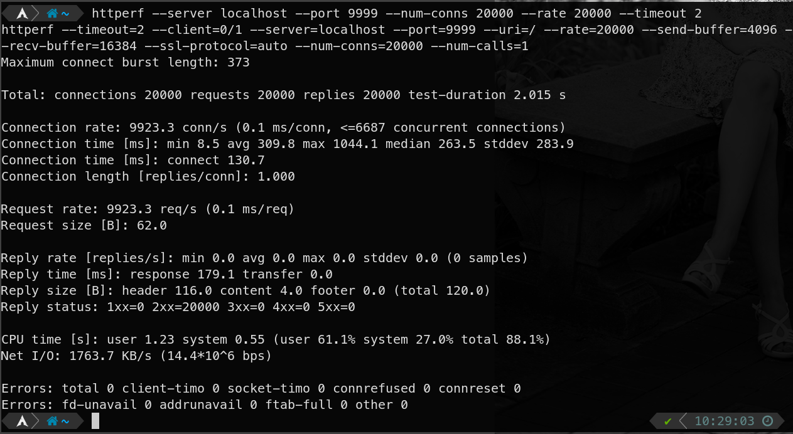

# Butler HTTP Client and Webserver


## Setup
This project is designed to run on Ubuntu20. Please read everything below before installing any software.
1) Setup your environment:
   * In order to ensure that you will be able to successfully build the binaries here you must install the following:
     * `make`
     * `cmake` **SEE BELOW**
     * `libssl-dev`
     * `libfmt-dev` **Ubuntu20 Required**
     * `gcc`
     * `build-essential`
2) Installing `cmake`:
   * I am using the latest version of `cmake` _3.19_ for this project. In order to install this version on Ubuntu 18 you must install it via snaps `sudo snap install cmake` or download a tar file and build it yourself. 
   * If you would like to build it yourself head over to this link (https://cmake.org/download/), download the Ubuntu tar file, unzip and untar the file, then `cd` into the cmake directory and run `./boostrap`. Once this is done running it will prompt you to run `make`.
3) To quickly get everything installed that you need you can run the `setup.sh` script contained in this repo. It will install everything that you need to build the project. **_NOTE_**: The setup script will install `cmake` via snap.

## Building and Executing

1) Once everything is installed execute the following commands:
```
bash setup.sh
mkdir build
cd build
cmake ..
make
```

The commands above will compile all the binaries. In order to compile just the one you like do the following:

**Client**
```
mkdir build; # if you haven't made this directory already
cd build;    # if you aren't already in the ./build directory
cmake ..;    # if you haven't created the make file yet
make client
./bin/client <URL>
```

**Parser**
```
mkdir build; # if you haven't made this directory already
cd build;    # if you aren't already in the ./build directory
cmake ..;    # if you haven't created the make file yet
make parser
./bin/parser <path_to_file_containing_http_request>
```

**Server**
```
mkdir build; # if you haven't made this directory already
cd build;    # if you aren't already in the ./build directory
cmake ..;    # if you haven't created the make file yet
make server
./bin/server --ip IP --port PORT [--cert CERT --key KEY]
```

Notes about the server:
   - PHP SUPPORT: PHP is supported for `GET` and `POST` requests. Parameters are accepted via the `request-target` for `GET` and in the request body for `POST`.
   - The server will create its root in `$HOME/butler-server` so it will need to have the correct permissions. A default `index.html` will also be written to that directory so that you can immediately test functionality.
   - As of right now, the `POST` method responds just like a `GET` request but will also display the body of the request in its response. This will be changed in the next assignment when we implement PHP.
   - If the server is operating in _HTTP_ mode and an _HTTPS_ request is made, the server will send back a `400 Bad Request` message which the browser will display as `Secure Connection Failed`. This cleanly handles the attempted connection and frees up the socket to handle the next request.
   - Logs will be generated in the same directory that you run `server` in. The log file will be called `butler.log`.
   - While the code may not explicitly show it, it does support multiple connections. I tried to thread the `requestHandler()` function but could not get it to be truly threaded without segfaults occuring. I was able to stress test the server (_see screenshot below_) and acheive very good results so I hope this is acceptable.


